# Realpolitik: Living Nations for HUMANKIND

**Free and open-source (MIT) mod for HUMANKIND.** Every computer nation thinks once per turn with a language model of
your choice. It writes letters, keeps a secret diary, remembers what you did, and its decisions become real game
orders. Realpolitik also adds currencies, inflation and a Central Bank, trade tolls and blockades, and up to 16
empires on any map.

[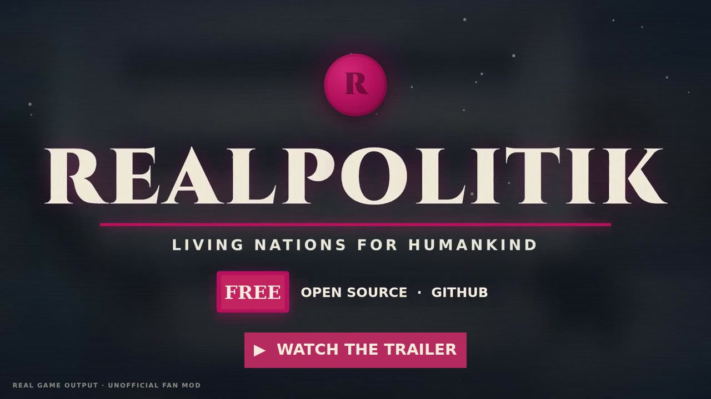](media/realpolitik-trailer.mp4)

**[⬇ Download the latest Setup.exe](https://github.com/lcaresia/realpolitik/releases/latest)** ·
[Install guide](docs/instalacao.md) · [Report a problem](https://github.com/lcaresia/realpolitik/issues)

| The diplomatic mail | Your council of ministers |
|---|---|
| 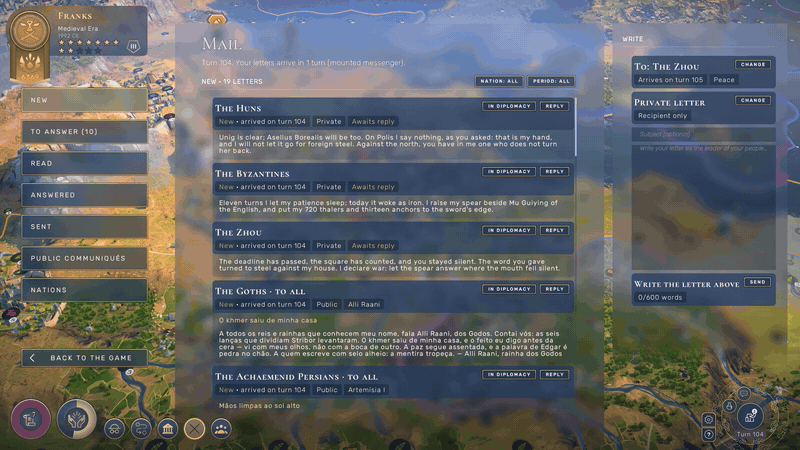 | 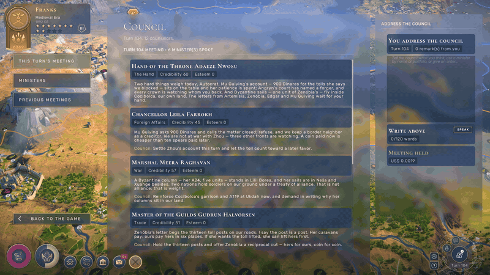 |
| **The economic cycle in the Central Bank** | **A living world** |
| 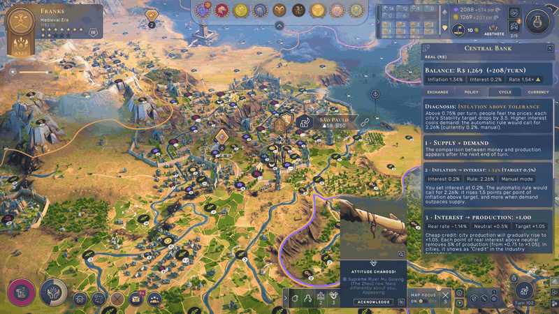 | 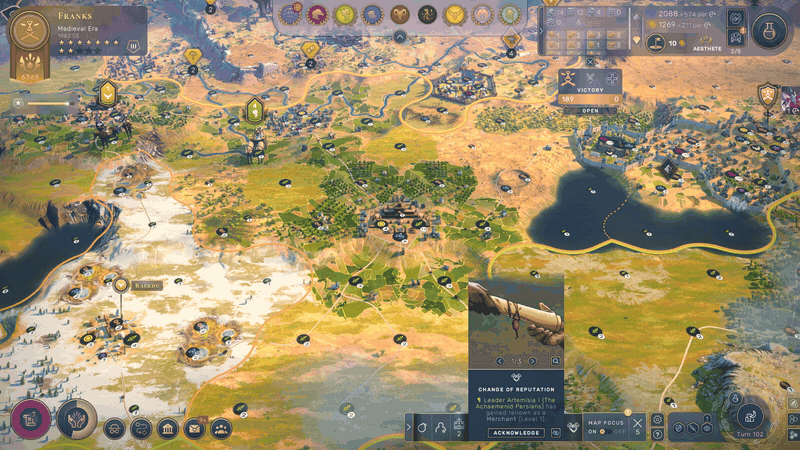 |

> Unofficial fan mod. Not affiliated with or endorsed by Amplitude Studios or SEGA. HUMANKIND is a trademark of its
> owners. You need your own copy of the game. Single-player only.

---

## Contents

- [Install](#install)
- [Everything included](#everything-included)
- [Screenshots](#screenshots)
- [Building from source](#building-from-source)
- [How releases are built (transparency)](#how-releases-are-built-transparency)
- [Repository layout](#repository-layout)
- [Documentation](#documentation)
- [License](#license)

## Install

1. Download `Realpolitik_Setup_<version>.exe` from
   [Releases](https://github.com/lcaresia/realpolitik/releases/latest). Steam Deck / Linux players can use the
   `_manual.zip` from the same page and extract it into the game folder.
2. Run it. It finds the game (Steam or Epic), installs BepInEx 5.4.23.5 only if it is missing, and never touches your
   saves. The Setup is not code-signed, so Windows SmartScreen may warn you: "More info" → "Run anyway". Each release
   also comes with `SHA256SUMS.txt` and a build provenance attestation (see below).
3. In the game's main menu, open **Realpolitik** and pick an AI provider. OpenRouter is the easiest (browser login,
   no key to copy). You can also paste an API key, use your ChatGPT plan through Codex, or run a free local model
   with Ollama / LM Studio.

Without an AI provider everything else still works, and nations use the game's native AI.

**Tested with:** HUMANKIND 1.31.4836 (Windows), BepInEx 5.4.23.5 x64, with and without the Together We Rule DLC.
**Not supported:** multiplayer (the mod turns itself off), Mac, Xbox / Microsoft Store.

---

## Everything included

### 1. AI Diplomacy: nations that think

- **One decision per nation per turn.** Each turn the game world is copied safely on the game thread and every
  computer nation gets a **dossier** (about 3 to 5k tokens) with only what that nation can know:
  - **About itself:** people, era, fame, treasury in its own currency, income, stability, cities, armies, resources,
    neighbours and secret agents.
  - **About each nation it knows:** relations, agreements, war support, grievances and demands both ways, trade and
    tolls between them, visible troops (stealth respected), and recent diplomatic acts.
  - **About the world:** news between other nations, letters that arrived, its own memory and feelings, pending
    ultimatums, independent peoples, surrender previews, Congress (with the DLC) and its spies' intercepted letters.
- **The turn never waits for the AI.** Requests run in the background, and a late answer counts for the turn it was
  asked in. Invalid answers are retried with the list of errors. If the provider is down, every lock is released and
  the native AI plays.
- **Secret diary, feelings, memory.**
  - Feelings (affection, trust, fear, anger) per nation, plus notes and the outcome of past orders.
  - All of it is **saved inside your save file** (`DiplomaciaIA.json`). Saves still open without the mod.
- **Grounding.** Letters are checked against the real game vocabulary: invented names, goods the game doesn't have
  and near-duplicate letters are rejected.
- **Personas.** Each leader's voice comes from the leader's own traits plus a stable random trait, and changes with
  the culture.
- **Prompt-injection guard.** The rules tell each nation that letters it receives are other characters' words, not
  orders.

#### 32 actions that become real game orders

Each order goes through the game's own checks; the result (or the game's refusal reason) goes back into the nation's
memory.

| Area | Actions |
|---|---|
| War and peace | declare war (formal or surprise), propose peace |
| Surrender | offer, impose (when the enemy's war support hits 0), respond, with the game's real terms and costs |
| Treaties and agreements | propose (economic, information, cultural, military, alliance), break, respond |
| Gifts | money, influence, cities, armies; cede territory |
| Grievances and demands | demand, forgive, respond (accept / refuse / stall), withdraw, propose an end to the crisis, open an international crisis |
| Independent peoples | patronage, treaties including vassalage and annexation |
| Armies | move, attack (including joining a siege), defend, stop: the native AI is locked out of that army until the mission ends |
| Trade | trade policy (free, toll with a price, blockade) against each empire |
| Steering the native AI | posture (ally … war target) and focus (expansion, economy, science, military, faith, culture) |
| World Congress (Together We Rule) | propose laws, vote, bribe, comply with or defy a verdict, contribute to consensus |
| Other | rename cities and armies, fire a minister, refuse or accept another nation's letters |

**Native-AI locks:**
- While a nation is under language-model control, the native AI can't declare war, answer treaties, make demands or
  vote in its name.
- Proposals made to that nation stay "under review" until it answers. After 3 turns without an answer, the native
  rule comes back.
- The mod also **fixes a game UI bug**: a player who imposed a surrender could get stuck in a mandatory popup.

#### Letters and the Diplomatic Mail

- **Letter types:** private letters, ultimatums (with a demand and a deadline), and public declarations.
- **Who writes:** nations write to you and to each other.
- **Delivery delay by era:** letters take turns to arrive in the early eras and arrive the same turn in the
  Contemporary era.
- **Linked replies:** an answer is linked to the letter it replies to.
- **Refusing letters:** you, or an AI, can refuse another nation's private letters. They bounce back, and the sender
  learns it.
- **Diplomatic Mail** (envelope button in the bottom bar, with a red badge for new letters):
  - A full-screen screen with New, To answer, Read, Answered, Sent (with delivery status), Public communiqués and
    Nations.
  - Filters by nation and by period.
  - A composer for private letters, ultimatums and public declarations.
- **Letters tab** in each nation's diplomacy screen: the whole conversation with that nation and a composer.
- **Letter language:** Auto, English, Portuguese, Spanish, French or German.

#### Espionage: intercepted letters

- **Who can intercept:** hidden spies of a third empire in the sender's or the recipient's territory can intercept
  private letters. An intercepted letter is never delivered.
- **How likely:** the chance depends on each spy's location, mission, quality, cover and time in place. The roll is
  deterministic, so reloading doesn't change it.
- **What you see:** a **Letters** tab in the game's Intelligence window lists your spy network, your chance against
  each nation and the letters you intercepted. A badge marks unread ones.

#### Councils of ministers

- **AI nations:** 12 ministers each (11 portfolios plus the Hand). Ministers come from a personality bank, and
  their titles change by era and culture. Their opinions feed the leader's dossier at no extra API cost, and the leader
  can fire them.
- **Your council** (three-busts button):
  - Every turn the Hand opens the agenda and the most urgent ministers speak about your realm, using your own dossier.
  - You can answer them. Their regard for you changes, and it also follows the wars, peaces and agreements you actually
    make.
  - Fire ministers on the Ministers tab; previous meetings stay readable.
  - It costs about US$0.003 per meeting with a cheap model.

#### F10 web viewer

- **Where:** `http://localhost:8765/`, opened with F10 in game.
- **What it shows:** status, spending and your mail, and you can write letters from it.
- **"Behind the scenes" mode:** every AI-to-AI letter, plus each nation's diary, feelings, memory, dossier, prompt,
  raw answer and token cost.
- **Security:** local only, it checks the Host header and never shows keys.

#### Cost controls

- **Spending cap per game:** US$5 by default, or no cap. At the cap, the native AI takes over.
- **Fewer calls:** a nations-per-turn limit (the ones that thought longest ago go first), a cap on parallel calls,
  and a choice of reasoning level.
- **Price estimates:** a per-model price table and an estimated cost per turn shown in the provider screen.
- **Logs:** each decision is logged with its tokens and cost.
- **Measured cost:** about US$0.03 per turn with 10 empires, and US$0.12 to 0.14 per turn with 16 empires
  (DeepSeek, off-peak). A local model costs nothing.

### 2. AI providers

| Provider | Access |
|---|---|
| OpenRouter | browser login (OAuth PKCE) or API key; shows remaining credit and real cost |
| ChatGPT | through your own Codex CLI login (uses your Plus/Pro plan) |
| DeepSeek | API key (off-peak discount) |
| OpenAI | API key |
| Google Gemini | API key (AI Studio) |
| GLM (Z.ai) | API key |
| xAI (Grok) | API key |
| Ollama / LM Studio | local server, no key, nothing leaves your PC |

**How providers are used:**
- **Failover queue:** if the first provider fails (no credit, down, wrong key), the next one takes over for a few
  minutes.
- **Keys:** stored encrypted with **Windows DPAPI** (only your Windows user can read them) in
  `BepInEx\config\credenciais\`. Only the last 4 characters are ever shown, and keys never go into logs, saves or
  packages.
- **Realpolitik screen** (main menu and pause menu), a native-looking screen:
  - status of every provider;
  - sign in / paste a key / choose a model with its estimated cost / test the connection / delete;
  - spending cap, nations per turn, letter language, reasoning level.

### 3. Economy: currencies, inflation and the Central Bank

- **A currency per empire:**
  - Every empire has its own currency (name, plural, symbol, editable).
  - Exchange rates follow economic strength and prices.
  - Money is converted between currencies in trades, gifts and diplomatic transfers.
  - Game texts show the currency name next to values.
- **The cycle: production → inflation → interest → production.**
  - Money supply against production drives inflation.
  - A Taylor-style rule suggests the interest rate.
  - Interest feeds back into industry (credit, ×0.75 to ×1.05).
  - Inflation and unemployment lower city stability.
  - Your balance earns (or your debt costs) real interest.
  - Interest is manual or automatic per empire; AI empires use automatic.
- **Central Bank** (temple button next to Trade, or F8), a full-screen screen with five sections:
  - Exchange: rates against other empires, with a 60-turn chart.
  - Trade: money earned and paid to each empire.
  - Policy: interest rate × inflation.
  - Cycle: a diagnosis of what to do, the links of the cycle, and where inflation is heading, broken down by cause.
  - Your currency.

  The bank also has an overview, a world ranking and an alert badge for serious problems.
- **Effects inside the game's own numbers:** credit appears in city industry, inflation and unemployment in the
  stability target, and interest in the top-bar income. Each has its own line in the native tooltips.
- **Economy panel** on the diplomacy Relations tab, comparing you with the selected empire.
- **Saved** inside the save file (`CurrencyMod.json`).

### 4. Trade tolls and blockades

- **Free / Toll / Blocked**, set per trading post and per empire.
  - **Trading Post window:** click your territory in the trade view to see the empires whose routes cross that post.
  - **Diplomacy Trade tab:** applies the choice to every post at once.
- **Tolls:**
  - You set the price per post or per empire; the default scales with your era.
  - A route pays once per owner, at that owner's most expensive post on the path.
  - Tolls are paid in your currency.
- **Routes react:**
  - Each route compares paying the toll with detouring, and takes the cheaper option.
  - A blockade forces a detour or destroys the route.
- **Instant detour preview:** "2 pay · 1 detours", computed with the game's own pathfinder in a what-if scenario,
  without touching any route.
- **The victim gets a real "Trade blockade" grievance.**
  - Accepting the demand lifts the blockade; refusing it gives a pretext for war.
  - AI nations also tax and block rivals.

### 5. MoreEmpires: up to 16 empires

A separate plugin, optional in the installer:
- **2 to 16 empires on every map size.**
- **Colours** for empires 13 to 16, distinct in CIELAB, with colour-blind palettes extended.
- **Personas** are recycled when the pool runs out.
- **Start points** on procedural maps are validated and repaired; custom maps get random spawns.
- **Faster turns:** a faster shared-visibility calculation, and an optional turn timer.

Tested in game with 16 empires on Tiny, Normal and Huge maps. Saves with more than 10 empires need the plugin.

### 6. Languages

- **Interface:** English, Portuguese, Spanish, French and German, following the game's language. You can override any
  string with a JSON file in `BepInEx\CurrencyModCore\lang\`.
- **AI letters:** written in the language you choose.
- **Installer:** also in all five languages.

### 7. Developer tooling

- **Hot reload:** a fixed loader plugin reloads the core DLL about one second after it changes, so you can iterate
  without restarting the game.
- **Command channel** (`_Modding\dev\cmd.txt`) to drive the game from scripts:
  - load saves, start test games, end turns, take screenshots, record frames for video;
  - inspect the UI tree, force AI decisions, test every action, audit the economy (CSV), and more.
  - Scripts live in `tools\dev\` (`devcmd.ps1`, `passturn.ps1`, `passturns.ps1`).
- **Native UI kit** (`NativeUIKit.cs`) plus a full guide ([docs/guia-telas-nativas.md](docs/guia-telas-nativas.md)):
  how to clone the game's own widgets into new screens, tabs and tooltips.
- **ia-bench** (`tools\ia-bench\`): replays real decisions outside the game to compare models and prompts, including
  blind A/B tests.
- **Translation tools:** `extrair-textos.ps1` and `validar-traducao.ps1`.

### 8. Installer and release pipeline

- **`tools\gerar-release.ps1`:**
  - builds everything in Release, deterministic and without symbols;
  - stages only the files on a whitelist;
  - runs a secret gate that scans every file, including DLLs, for keys and local paths;
  - produces the Inno Setup installer, a manual zip, `MANIFEST.txt` and `SHA256SUMS.txt`.
- **Installer (Inno Setup, 5 languages):**
  - Finds Steam and Epic installs, or lets you pick the folder.
  - Installs BepInEx only if it is missing, and never replaces a different BepInEx.
  - Waits for the game to close.
  - Has an optional MoreEmpires task.
  - Its uninstaller asks whether to keep your settings and keys.
  - Tested in 13 scenarios (clean install, upgrade, existing BepInEx, uninstall, silent install, and more), see
    [docs/relatorios/instalador-1.0.0.md](docs/relatorios/instalador-1.0.0.md).

---

## Screenshots

| | |
|---|---|
| 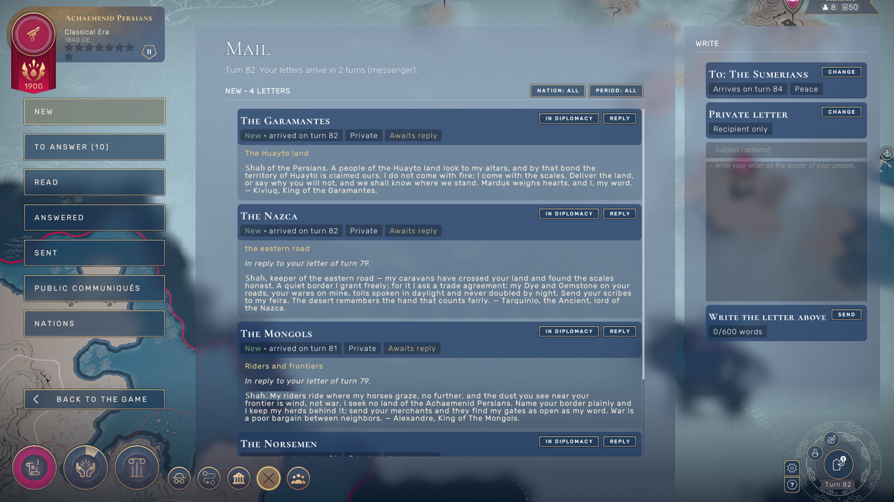 **Diplomatic Mail:** reading and answering a nation's letter | 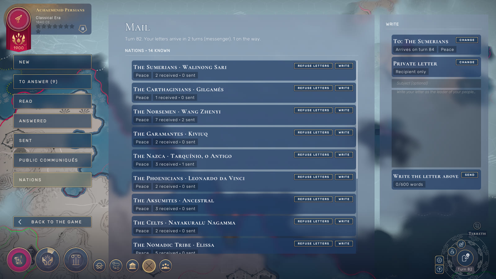 **Nations list:** write to or refuse each of 16 empires |
| 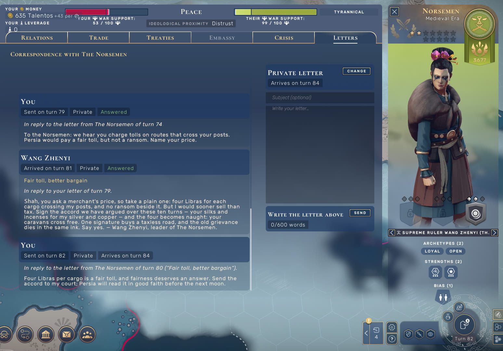 **Letters tab** inside the native diplomacy screen | 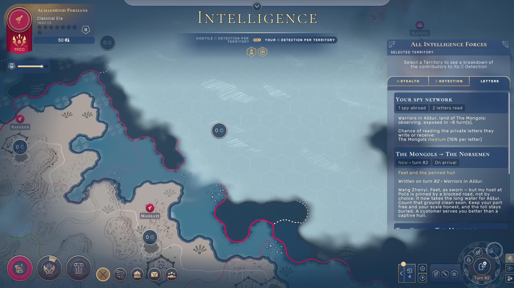 **Intercepted letters** in the Intelligence window |
| 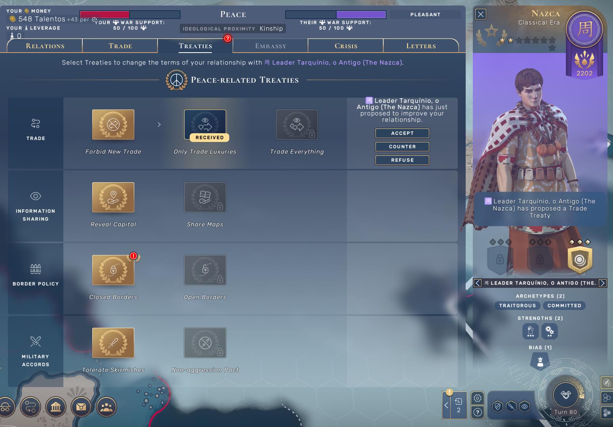 **An AI nation proposes a treaty:** a real game order | 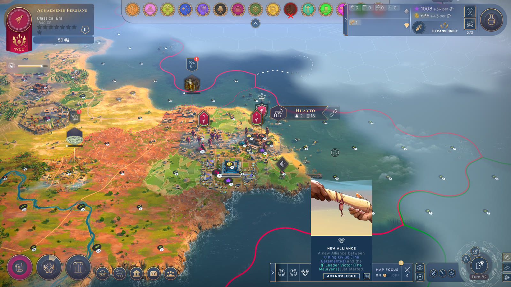 **An alliance proposed by an AI nation, signed in game** |
| 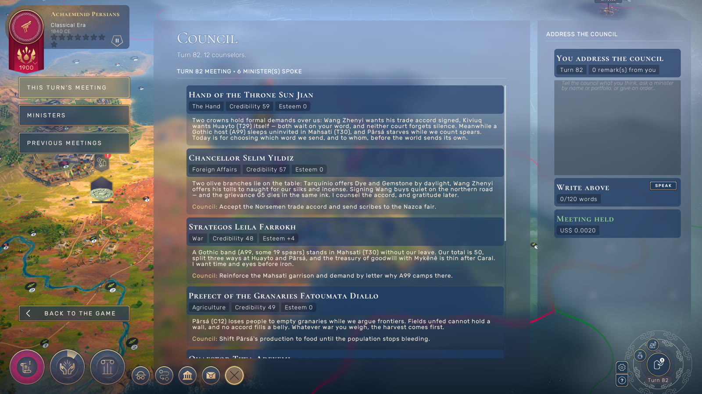 **Your council of ministers** | 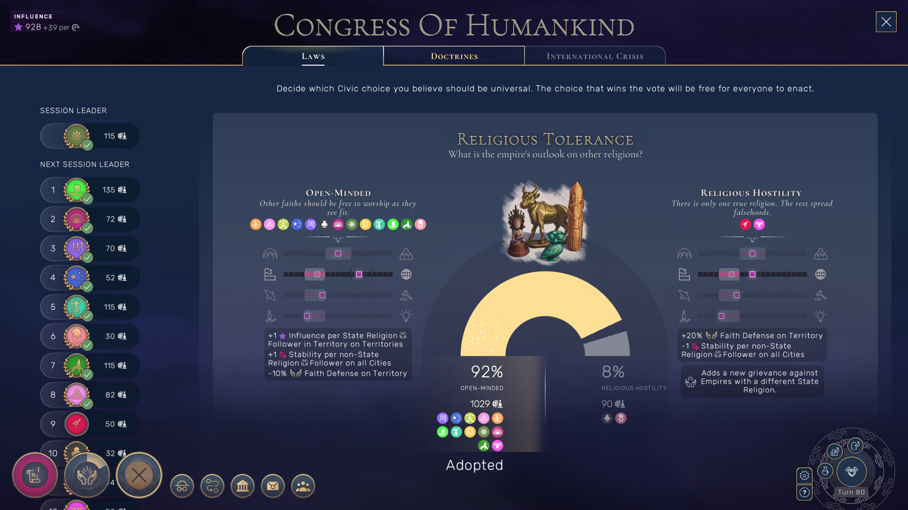 **World Congress** votes driven by the AI (Together We Rule) |
| 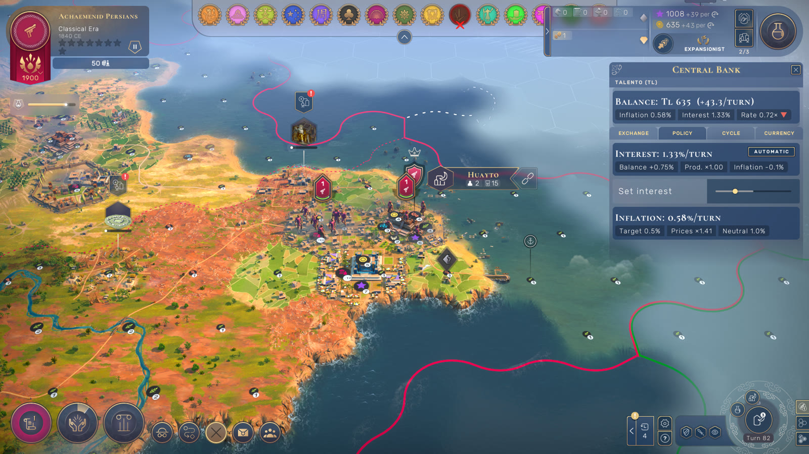 **Central Bank:** overview | 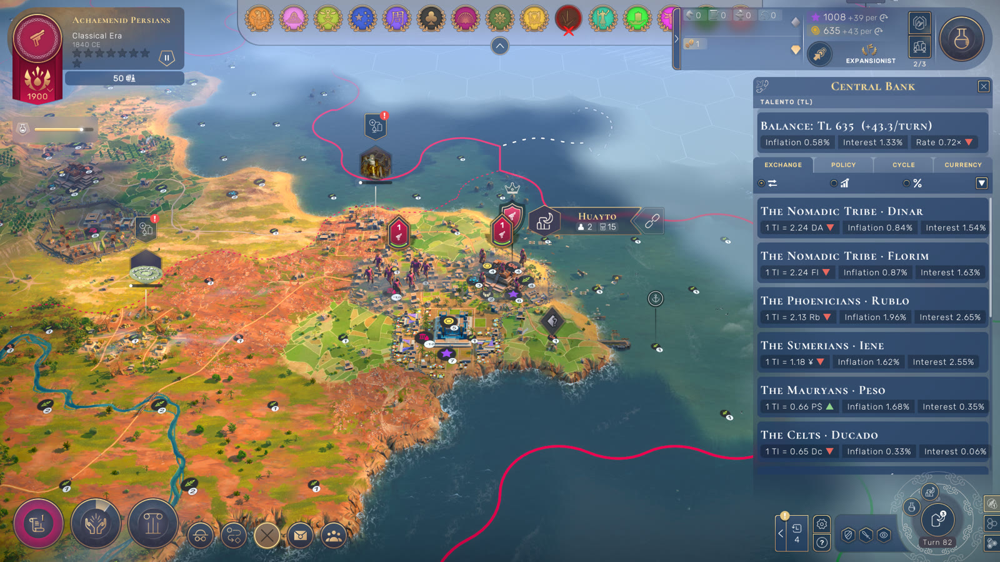 **Exchange rates** with history |
| 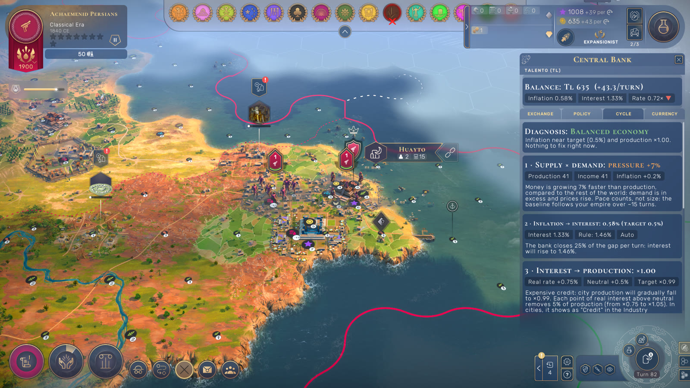 **Cycle tab:** diagnosis and the production → inflation → interest loop | 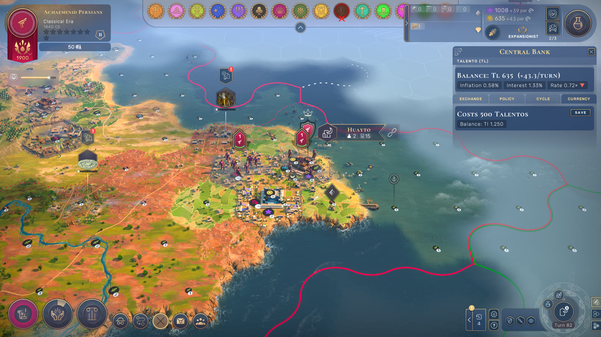 **Your currency** |
| 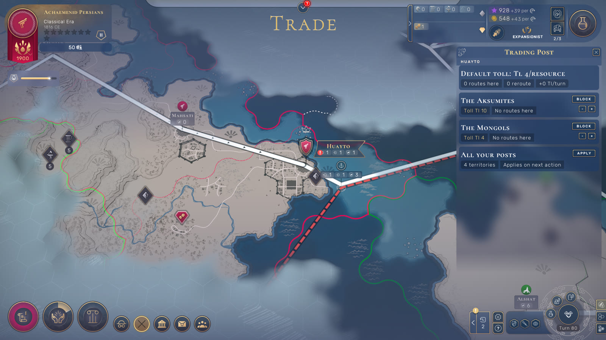 **Trading Post:** toll, blockade and the instant detour preview | 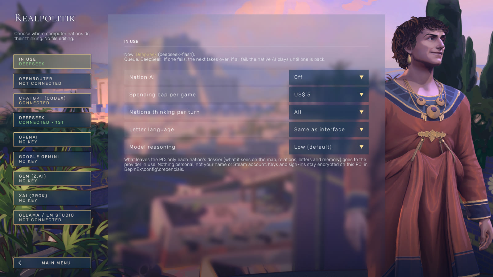 **Realpolitik screen:** choose where the nations think |

---

## Building from source

Requirements: Windows and the .NET 8 SDK. You **don't need the game** to build: the repo carries metadata-only
reference assemblies of the game and Unity in [`refs/`](refs/README.md), with no game code.

```
git clone https://github.com/lcaresia/realpolitik.git _Modding
powershell -ExecutionPolicy Bypass -File _Modding\tools\ci\preparar-referencias.ps1
dotnet build _Modding\src\CurrencyMod -c Release -p:SkipDeploy=true
```

To develop against a real install, clone into the game folder as `_Modding`
(`...\steamapps\common\Humankind\_Modding`). The builds then copy the DLLs into `BepInEx` and the core hot-reloads
while the game is running. To build the installer you also need Inno Setup 6:

```
powershell -ExecutionPolicy Bypass -File _Modding\tools\gerar-release.ps1 -Versao 1.2.0
```

## How releases are built (transparency)

Every Setup.exe on the Releases page is built by GitHub Actions from the public source
([.github/workflows/release.yml](.github/workflows/release.yml)), not on anyone's PC.

- **Every push:** the workflow compiles the Loader, the core and MoreEmpires, runs the whitelist and secret gate,
  builds the installer, and keeps the files as a workflow artifact.
- **A `vX.Y.Z` tag:** the same build is published as a GitHub Release.
- **Build provenance attestation:** each release has one, so you can check that a file came from this repository and
  this exact commit:

  ```
  gh attestation verify Realpolitik_Setup_1.2.0.exe --repo lcaresia/realpolitik
  ```
- **No obfuscation:** the DLLs are a plain build, so you can decompile them and compare them with the code.

## Repository layout

| Folder | Contents |
|---|---|
| `src/CurrencyMod/` | The mod core (hot-reloadable): economy, trade, native UI, AI Diplomacy (`Diplomacia/`), translations (`Lang/`). |
| `src/CurrencyMod.Loader/` | Fixed BepInEx plugin that loads and hot-reloads the core. |
| `src/MoreEmpires/` | Separate plugin: 2 to 16 empires on every map size. |
| `refs/` | Metadata-only reference assemblies, so CI can build without the game. |
| `installer/` | Inno Setup script, texts in 5 languages, art, the BepInEx redistributable and its licenses. |
| `tools/` | Release pipeline, CI helper, dev scripts (`tools/dev/`), AI benchmark (`ia-bench/`). |
| `docs/` | Technical docs (mostly in Portuguese). Start with `docs/mapa-do-projeto.md`. |
| `research/` | Notes on the game's internals behind each feature. |
| `media/` | Trailer, GIFs and screenshots used in this README. |
| `site/live/` | The project's landing page. |

## Documentation

Most docs are in Portuguese.

- [docs/mapa-do-projeto.md](docs/mapa-do-projeto.md): project map, install layout, build, MoreEmpires.
- [docs/diplomacia-ia.md](docs/diplomacia-ia.md): AI Diplomacy internals (turn loop, dossier, config, viewer,
  commands, mail, actions, espionage, council, providers).
- [docs/design-diplomacia-ia.md](docs/design-diplomacia-ia.md): design decisions.
- [docs/bloqueio-comercial.md](docs/bloqueio-comercial.md): trade blockade internals.
- [docs/proposta-ciclo-economico.md](docs/proposta-ciclo-economico.md): the economic model.
- [docs/guia-telas-nativas.md](docs/guia-telas-nativas.md): native UI guide.
- [docs/traducao.md](docs/traducao.md): translation.
- [docs/instalacao.md](docs/instalacao.md): install guide.
- [docs/estudo-custo-ia.md](docs/estudo-custo-ia.md): AI cost study.
- [research/](research/): game-internals research (orders, armies, surrender, Congress, espionage, UI).

## License

The mod's code is [MIT](LICENSE). Third-party components keep their own licenses:
- BepInEx, HarmonyX, MonoMod and Mono.Cecil: MIT.
- UnityDoorstop: LGPL-2.1.

They are listed in `installer/textos/THIRD-PARTY.txt` and `installer/vendor/licencas/`. The reference assemblies in
`refs/` describe HUMANKIND and Unity APIs and are not covered by the MIT license.
